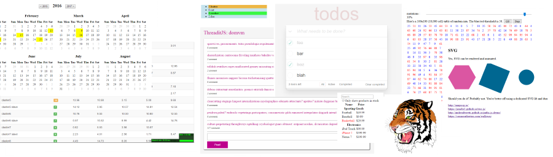

domvm (DOM ViewModel)
---------------------
A thin, fast, dependency-free vdom view layer _(MIT Licensed)_

---
#### Philosophy

UI-centric, exclusively declarative components suffer from locked-in syndrome, making them unusable outside of a specific framework. Frequently they must extend framework classes and adhere to compositional restrictions which typically mimic the underlying DOM tree and sacrifice powerful exposed APIs for the sake of designer-centric ease and beauty.

Instead, domvm offers straightforward, pure-js development without opinionated structural or single-paradigm buy-in. Uniformly compose imperative and declarative views, expose APIs, hold private state or don't, dependency-inject or closure, build monolithic or loosely coupled components.

Architect reusable apps without fighting a pre-defined structure, learning tomes-worth of idiomatic abstractions or leaning on non-reusable, esoteric template DSLs.

---
#### Features

- Thin API, no dependencies, build = concat & min
- Fast (2x Mithril, React, Riot; 1.3x Vue, Angular 2, Aurelia) - [dbmonster](http://leeoniya.github.io/domvm/test/bench/dbmonster/), [granular patch](http://leeoniya.github.io/domvm/test/bench/patch/)
- Small - ~7k all modules gzipped: 11k view core, 2k router, 2.3k observers, 0.8k isomorphism
- Concise js templates. No html-in-js, js-in-html or other esoteric syntax requiring tooling/compilation
- Sub-views - declarative *or* imperative, freely composable, stateful and independently refreshable
- Synthetic events - emit custom events with data to ancestor views
- Lifecycle hooks - view-level and granular node-level for e.g. [async animations](https://leeoniya.github.io/domvm/demos/lifecycle-hooks.html)
- Decoupled client-side router (for SPAs) & mutation observers (for auto-redraw)
- Isomorphic - generate markup server-side and attach on client
- SVG & MathML support: [demo](http://leeoniya.github.io/domvm/demos/svg_mathml.html), [svg tiger](http://leeoniya.github.io/domvm/demos/svg-tiger.html)
- IE9+ with tiny polyfills/shims [sources](src/polyfills), [all compressed](dist/polyfills.min.js): `view` (rAF, element.matches), `watch` (Promise, fetch)

---
#### Demos



https://leeoniya.github.io/domvm/demos/

---
#### Documentation

0. [Installation](#installation)
0. [Modules, Building](#modules-building)
0. [Template Reference](#template-reference)
0. [Create, Modify, Redraw](#create-modify-redraw)
0. [Subviews, Components, Patterns](#subviews-components-patterns)
0. [Trigger Ancestor redraw()](#trigger-ancestor-redraw)
0. [Lifecycle Hooks, Async Animation](#lifecycle-hooks-async-animation)
0. [Synthetic Events, emit(), on:{}](#synthetic-events-emit-on)
0. [DOM Refs, Raw Element Access](#dom-refs-raw-element-access)
0. [Isomorphism, html(), attach()](#isomorphism-html-attach)
0. [Route Module](#route-module)
0. ...WIP, help wanted! https://github.com/leeoniya/domvm/issues/36

---
#### Installation

**Browser**

```html
<script src="domvm.min.js"></script>
```

**Node**

```js
var domvm = require("domvm");
```

---
#### Modules, Building

Each module is a single js file in `/src`. The first 3 are the "core", the rest are optional and can be replaced by your own implementations. For development, just include each via `<script>` tags.

0. `domvm`: namespace & wrapper
0. `domvm.utils`: generic funcs required by other modules
0. `domvm.view`: the core vdom & template lib
0. `domvm.html`: vtree => HTML generator, if you need isomorphism/SSR
0. `domvm.watch`: auto-redraw helpers (mutation observers, ajax wrappers)
0. `domvm.route`: router & href generator for single page apps (SPAs)

Building is simple: concat the needed modules and minify with tools of your choice. [Closure Compiler](https://developers.google.com/closure/compiler/docs/gettingstarted_app) is recommended for both:

```
java -jar compiler.jar
	--language_in ECMASCRIPT5
	--js src/domvm.js
	--js src/utils.js
	--js src/view.js
	--js src/html.js
	--js src/watch.js
	--js src/route.js
	--js_output_file dist/domvm.min.js
```

---
#### Template Reference

domvm templates are a superset of [JSONML](http://www.jsonml.org/)

If you prefer *hyperscript*, just use this wrapper:

```js
function h() {
	return Array.prototype.slice.call(arguments);
}
```

```js
["p", "Hello"]												// plain tags
["p#foo.bar.baz", "Hello"]									// id and class shorthands

["input",  {type: "checkbox",    checked: true}]			// boolean attrs
["input",  {type: "checkbox", ".checked": true}]			// set property instead of attr

["button", {onclick: function(e) {...}},  "Hello"]			// event handlers
["button", {onclick: [myFn, arg1, arg2]}, "Hello"]			// event handlers (parameterized)
["ul",     {onclick: {".item": function(e) {...}}}, ...]	// event handlers (delegated)

["p",      {style: "font-size: 10pt;"}, "Hello"]			// style can be a string
["p",      {style: {fontSize: "10pt"}}, "Hello"]			// or an object (camelCase only)
["div",    {style: {width: 35}},        "Hello"]			// "px" will be added when needed

["h1", {class: "header"},									// (props object is optional)
	["em", "Important!"],									// child nodes follow tag
	"foo",													// and can be text nodes
	myElement,												// or existing DOM nodes
	function() { return ["div", "clown"]; },				// or getters returning a child
]

["h1", [													// explicit child array can be provided
	["em", "Important!"],									// (but first child cannot be a function
	["sub", "tiny"],										// or string...cause ambiguous)
	[														// any sub-arrays will get flattened
		["strong", "stuff"],								// but are subject to same conditions
		["em", "more stuff"],
	],
]]

["p", function() {											// getter can return child array
	return [
		["span", "foo"],
		["em", "bar"],
	];
}]

["textarea", {rows: 50}].concat([							// use concat() to avoid explicit
	"text",													// child array restrictions
	["br"],
	"", null, undefined, [],								// these will be removed
	NaN, true, false, {}, Infinity							// these will be coerced to strings
])

["#ui",														// same as "div#ui"
	[NavBarView, navbar],									// sub-view w/model
	[PanelView, panel, "panelA"],							// sub-view w/model & key
	preInitVm,												// pre-initialized ViewModel
]

// special _* props

[".myHtml", {_raw: true}, "<p>A am text!</p>"]				// raw innerHTML body
["p", {_key: "myParag"}, "Some text"]						// keyed nodes
["p", {_ref: "myParag"}, "Some text"]						// named refs (via vm.refs.myParag)
["p", {_data: {foo: 123}}, "Some text"]						// per-node data (faster than attr)
```

---
#### Create, Modify, Redraw

```js
// view closure
function PeopleView(vm, people) {
	// This is the view init/constructor which receives the data/model.
	// Use it to store private state, cache, private funcs, etc.

	// This is render() and will be called on each redraw() to regenerate the template
	return function() {
		return ["ul.people-list", people.map(function(person) {
			return ["li", person.name + " (aged " + person.age + ")"];
		})];
	};
}

// model/data
var myPeeps = [
	{name: "Peter", age: 31},
	{name: "Morgan", age: 27},
	{name: "Mark", age: 70},
];

// init view, passing the model
var vm = domvm.view(PeopleView, myPeeps);

// render to document
vm.mount(document.body);

// modify the list
myPeeps.shift();
myPeeps.push(
	{name: "Allison", age: 15},
	{name: "Sergey", age: 39}
);

// redraw
vm.redraw();
```

---
#### Subviews, Components, Patterns

In very large apps, you may need to optimize performance by restricting what you redraw. Let's restructure the example into nested sub-views.

**Pattern A:** decoupled-model-view

Here, the views are separated from the pure-data models. During initial redraw, the views expose themselves back into the models to provide external redraw control.

```js
// views
function PeopleView(vm, people) {
	return function() {
		return ["ul.people-list", people.map(function(person) {
			// declarative sub-view composition (parent links the view to model)
			return [PersonView, person];
		})];
	};
}

function PersonView(vm, person) {
	// expose the imperative view
	person.vm = vm;

	return function() {
		return ["li", person.name + " (aged " + person.age + ")"];
	};
}

var myPeeps = [
	{name: "Peter", age: 31},
	{name: "Morgan", age: 27},
	{name: "Mark", age: 70},
];

var peepVm = domvm.view(PeopleView, myPeeps).mount(document.body);
```

Now we can redraw each model's view independently.

```js
// modify the list
var allison = {name: "Allison", age: 15};
var sergy = {name: "Sergey", age: 39};

myPeeps.push(allison, sergy);

// redraw list (this inits and exposes the new vms)
peepVm.redraw();

// modify a specific person
allison.age = 100;

// redraw person (sub-view)
allison.vm.redraw();
```

**Pattern B:** view-linking-model

You can opt for slight coupling by having the models pre-define a model-view pairing, moving that responsibility out of any parent templates. Below, we employ OO models, but you could use `Object.create` or other more pure methods to achieve the same goals.

```js
// models
function People(list) {
	this.list = list;

	this.view = [PeopleView, this];
}

function Person(name, age) {
	this.name = name;
	this.age = age;

	this.view = [PersonView, this];
}

// views
function PeopleView(vm, people) {
	people.vm = vm;

	return function() {
		return ["ul.people-list", people.list.map(function(person) {
			// declarative sub-view composition (model exposes its own binding)
			return person.view;
		})];
	};
}

function PersonView(vm, person) {
	person.vm = vm;

	return function() {
		return ["li", person.name + " (aged " + person.age + ")"];
	};
}

var myPeeps = [
	new Person("Peter", 31),
	new Person("Morgan", 27),
	new Person("Mark", 70),
];

var people = new People(myPeeps);

var vm = domvm.view(people.view);
```

**Pattern C:** view-enclosing-model

Continuing our steady march towards progressively more monolithic components, you can enclose the views in the models to make each component more self-contained. You can also imperatively pre-init the views (vms), for example:

```js
// view-enclosing OO components with imperative vm init
function People(list) {
	this.list = list;

	// pre-init the vm imperatively
	this.vm = domvm.view(PeopleView, this);

	function PeopleView(vm, people) {
		return function() {
			return ["ul.people-list", people.list.map(function(person) {
				// imperative sub-view composition (model exposes its own view)
				return person.vm;
			})];
		};
	}
}

function Person(name, age) {
	this.name = name;
	this.age = age;

	this.vm = domvm.view(PersonView, this);

	function PersonView(vm, person) {
		return function() {
			return ["li", person.name + " (aged " + person.age + ")"];
		};
	}
}
```

**Pattern D:** model-enclosing-view

This is similar to how React components work and inverts the model-view structure to be more UI-centric, with every component being both the model and a single view without explicit model constructors or OO.

```js
function PeopleView(vm, people) {
	return function() {
		return ["ul.people-list", people.map(function(person) {
			return [PersonView, person];
		})];
	};
}

function PersonView(vm, person) {
	return function() {
		return ["li", person.name + " (aged " + person.age + ")"];
	};
}

var people = domvm.view(PeopleView, myPeeps);
```

**Pattern E:** make up your own!

The above examples demonstrate the flexibility afforded by uniformly-composable imperative and declarative paradigms. For instance, models can expose multiple views which can then be consumed by disjoint parts of some larger template, such as a single `NavMenu` component with shared state and sitemap tree but exposing split `TopNav`, `SideNav` and `FooterNav` views. Alternatively or additionally, more views of your model can be constructed after the fact if you choose to expose enough state/api.

---
#### Trigger Ancestor redraw()

You can invoke `.redraw()` of any ancestor view (e.g. parent, root) by passing a numeric `level`.

```js
// redraw self, same as vm.redraw()
vm.redraw(0);

// redraw parent (& descendents)
vm.redraw(1);

// redraw root (& descendents) by passing some huge value
vm.redraw(1000);
```

---
#### Lifecycle Hooks, Async Animation

**Demo:** [lifecycle-hooks](https://leeoniya.github.io/domvm/demos/lifecycle-hooks.html) different hooks animate in/out with different colors.

**Node-level**

Usage: `["div", {_hooks: {...}}, "Hello"]`

- will/didInsert (initial insert)
- will/didRecycle (reuse & patch)
- will/didReinsert (detach & move)
- will/didRemove

Node-level `will*` hooks allow a Promise/thennable return and can delay the event until the promise is resolved, allowing you to CSS animate, etc.

**View-level**

Usage: `vm.hook("didRedraw", function() {...})` or `vm.hook({didRedraw: function() {...}})`

- will/didRedraw
- will/didMount
- will/didUnmount

View-level `will*` hooks are not yet promise handling, so cannot be used for delay, but you can just rely on the view's root node's hooks to accomplish similar goals.

---
#### Synthetic Events, emit(), on()

Custom events can be emitted up the view hierarchy (with data) and handled by ancestors. When a matching handler is found, the callbacks are executed and the bubbling halts.

```js
function ParentView(vm) {
	vm.on({
		myEvent: function(arg1, arg2) {
			console.log("caught myEvent", arguments);
		}
	});

	return function() {
		return ["div", [ChildView]];
	};
}

function ChildView(vm) {
	var handleClick = function(e) {
		vm.emit("myEvent", "arg1", "arg2");
	};

	return function() {
		return ["em", {onclick: handleClick}, "some text"];
	};
}
```

---
#### Node Refs, DOM Element Access

Virtual nodes created by templates can be accessd via `vm.refs.*`. Since DOM nodes can be recycled, always access the refs object via the vm since it will get re-generated on each redaw.

```js
function SomeView(vm) {
	function handleMyBtnClick() {
		// access the created DOM node under "strongFoo" virtual node
		vm.refs.strongFoo.el;
	}

	return function() {
		return ["div",
			["strong", {_ref: "strongFoo"}, "Strong foo text"],
			["br"],
			["a.myBtn", {href: "#", onclick: handleMyBtnClick}, "some link"],
		];
	};
}
```

---
#### Isomorphism, html(), attach()

```js
function SomeView(vm) {
	return function() {
		return ["div#foo", "foobar"];
	};
}

// on the backend
var vm = domvm.view(SomeView, someModel);
// have server barf this html into the returned document
var html = domvm.html(vm);

// ...then on the front-end
var vm = domvm.view(SomeView, someModel);
// instead of mount(), use attach()
vm.attach(document.getElementById("foo"));
```

---
### Route Module

The `route` module is a small, unassuming router. It takes your route definitions and invokes handlers on `hashchange` or `popstate` events. It can parse and regex-validate params, generate hrefs & click handlers for use in templates and provides a `goto` API.

High-level example:

```js
// router closure (should return named routes)
function MyRouter(router, deps) {
	return {
		home: {
			path: "/",
			onenter: function() {
				// do something with injected deps
				// call apis, load up state, redraw views
			},
			onexit: function() {
				// save state, unload stuff
			}
		},
		blogPost: {
			path: "/blog/posts/:slug",
			vars: {slug: /[a-z0-9\-]+/},
			onenter: function(segs) {
				// do something with segs.slug & injected deps
			},
		}
	};
}

// some initialized model
var deps = {app: myApp};

// init router, inject deps
var router = domvm.route(MyRouter, deps);

// use window.location to invoke current route
router.refresh();

// nav to a string location
router.goto("/blog/posts/some-viral-heading-2016");

// or a generated location
router.goto("blogPost", {slug: "some-viral-heading-2016"});

// use the router to generate hrefs (which also implicitly binds onclick in useHist mode)
["a", {href: router.href("blogPost", {slug: "some-viral-heading-2016"})}, "Some Viral Heading 2016!!!"];

// get the current route object, including parsed params
var curRoute = router.location();
```

Some things to keep in mind. The `router` argument passed to the closure is the same one returned by externally. However, until the closure returns the routes, it is not fully initialized and cannot be used from inside for routing yet. If you perfer to keep everything in the closure, you can set up some config:

```js
function MyRouter(router, deps) {
	router.config({
		// Use history API instead of '#' hashes. Default is false (see below).
		useHist: false,
		// A root prefix must be specified if the SPA is not running under
		// the domain root (only needed if using the history API)
		root: "/myApp",
		init: function() {
			// This function will be called once the router has initialized and is able to route.
			// Use it to mount or redraw your app's root view. It's recommended that you dep-inject
			// the router into your app before mounting so it can use href generation for its templates
			// and `router.location()` to determine and render the appropriate views
		},
		// if provided, the funcs below will fire after a route is matched but before its handler is invoked.
		// they can return `false` to prevent route's onenter/onexit handlers from firing
		willEnter: function(to, from) {},
		willExit:  function(from, to) {},
	});

	return {
		// route defs
	};
}
```

For a working example of this, check out `/demos/threaditjs`: https://github.com/leeoniya/domvm/blob/1.x-dev/demos/threaditjs/app.js#L3-L49


---
### Demos

See /demos and /test/bench
